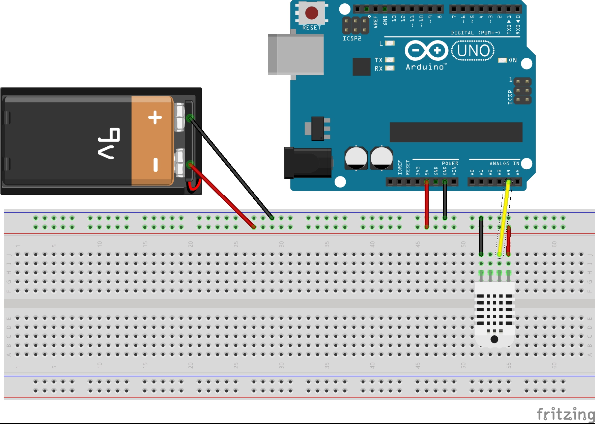
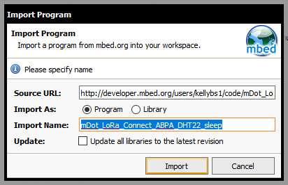
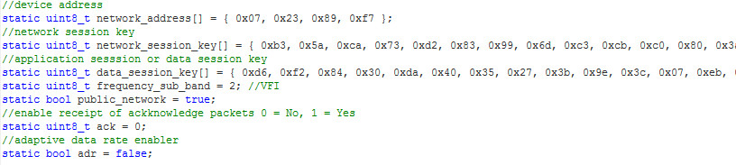
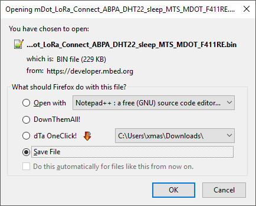

# mDot-FullyFunctionalNode-915

## Combining previously learned function to build a node that senses data, sends it over a LoRaWAN, and then sleeps/wakes

### Preparation

Must already have mbed.org account set up. If that is not done, see the following documentation: [mDot-SetupAccount] (https://gitlab.op-bit.nz/BIT/Project/Internet-Of-Things/nodes/tree/master/mDot-SetupAccount)

## Required Hardware

- mDot - 915
- MultiTech mDot UDK board
- DHT22 Sensor
- 9v battery connector

## Wiring

Using the corresponding Arduino pins on the UDK

### Wiring standard:

Red wires should only be used for voltage.

Black wires should only be used for ground.

Wires of other colors can be used to connect pins to analog or digital. 

## Code:

https://os.mbed.com/users/jakef1/code/mDot_LoRa_ClassroomSensor/

## Importing our example program

On the right of the screen, click _Import into Compiler_.

In the Compiler click to import the program as a program.

Near the top of the program, change the network setting values to match the settings required for your LoRaWAN.

If adaptive data rate is disabled. For example: `static bool adr = false;`

Scroll down to: `dot->setTxDataRate(mDot::DR2);`

Set your required data rate here.

Click _Compile_ and download the bin file when prompted.

## Load Program onto mDot

- Attach the mDot to the UDK board, and attach the UDK to a PC via USB
- The mDot should appear in the pc as a flash drive would for example *MULTITECH (F:)*
- Copy the binary file to this drive. The mDot might automatically restart automatically, but if it does not, press the Reset button on the UDK.

## Seeing debug info on a PC over USB

- On Windows you must install serial-USB driver from here: [http://www.st.com/en/embedded-software/stsw-link009.html](http://www.st.com/en/embedded-software/stsw-link009.html)
- Open a serial terminal. I used the Arduino IDE's serial monitor set to the correct COM port (this varies depending on the machine) at 9600 baud
- If the application runs correctly and the serial monitor is configured correctly you should see debugging output

## Results:

A standard 9V battery starts at around 9.6V when tested using a multimeter. Anything lower than 7V is too low for a fresh battery. I left the node running for three weeks, thn tested it again.

First battery test taken on the 5th of August: 9.6V
Second test taken on the 26th of August: 0.77v 

This means that over a three week (21 day) period the node used about 8.83v of power from the battery. At one reading per minute this is an estimated 30,000 readings before the battery died. To increase battery life the time between readings will be increased.
